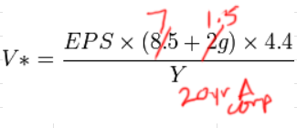

# PortfolioAnalysisMonorepo

### Introduction

The idea behind this project is to automate investment analysis by creating a data pipeline. 
I currently research stocks in my portfolio and watchlist via Google Sheets. This requires 
some manual work for each stock. The goal is to automate this manual work via the data pipeline
which will just require a list of tickers. 

The data pipeline will consist of a client that fetches Yahoo finance data via the Yfinance API in python.
(Chose yfinance because most of the numbers I generally use are from there...) This client will in turn
send the fetched data to a server (Java or CPP) via UDP Datagram Channels. The server in turn will parallelize the
valuation process, computing the values and sending the data to a Kafka broker. The aforementioned Kafka broker will run on a custom built server that I constructed at home from scratch. A Python kafka consumer will read from the valuation Kafka topic and push data
to a google sheet where I can see all the valuations with some cell formatting perhaps. 

#### Underlying Valuation Technique
The underlying valuation technique is not a DCF or anything super complex -- it's a simple formula
adapted from Ben Graham's Intelligent Investor. It attempts to come up with a valuation of a stock,
or more so a price estimate that could be compared with the actual market price to make an investment
decision. 



The formula is comprised of:
* EPS 
    * Trailing twelve month earnings per share. Note that these numbers are reported in GAAP/ non GAAP formats depending on the source.
* PE ratio no growth
    * I took this to mean the acceptable PE ratio for a company with no growth prospects. In Ben Graham's original 
    formula this value was 8.5 but I corrected this to 7.
* g - Growth rate
    * Obviously no one can really predict the growth rate, but the numbers from Wall Street are better than any number the layman comes up with.
* Y - 20 Year Corporate Bond Yield
    * TODO: double check why this is used in the formula.
    * https://fred.stlouisfed.org/series/AAA

Disclaimer:
I understand that valuation isn't a sure fire investment technique. A stock could be under valued as per this formula and drop the next day. But as much as valuation can be used to decide to buy a stock, it could also be used to decide when NOT to buy a stock. For example, some companies with negative earnings per share aren't even profitable. Obviously, that same company could be on the way to profitability but you'll at least have an idea of the current company state...

#### Custom Server Construction
I got an old server from work with no OS and no hard disk, but thought it might be a useful exercise to construct a server myself.
I had an old SATA hard drive with Windows 10 installed on it, and initially used that to boot up the server. It worked for 4 days, but 
the disk itself showed 18% fragmentation... which didn't make sense to me because there was still ~700 GB available on the drive.
Regardless, I ran a built in Windows disk clean up operation. This ran all night and still didn't finish. A short time after this the
hard drive wasn't getting recognized, maybe because I touched it or shifted the server accidentally.. not sure. 

I then had to resort to installing a SATA compatible hard drive and the OS. For the former I purchased a 1 TB Kingston hard drive. For the latter
I created a bootable USB drive with Windows 10 on it from an 8GB flash drive. To use the USB drive you can rearrange the ordering of the boot devices (hard drive, USB drive, etc). You also use the UEFI boot option to boot the system from a hard drive or USB drive. After this, I successfully had the server up and just needed to run/install Kafka on it and open up the port to make it accessible on the local network.

##### Kafka Broker Setup and Port Opening on Local Subnet
After installing Kafka on the server, I opened the port Kafka runs on to my home network. This requires editing the
Windows Firewall to allow incoming connections. I then pinged the server from my laptop as seen below. 

Connection Succeeded:
```
curl -vvv 127.0.0.1:9092
*   Trying 127.0.0.1:9092...
* Connected to 127.0.0.1 (127.0.0.1) port 9092
> GET / HTTP/1.1
> Host: 127.0.0.1:9092
> User-Agent: curl/8.7.1
> Accept: */*
>
* Request completely sent off
* Empty reply from server
* Closing connection
curl: (52) Empty reply from server
```
Connection Failed:
```
curl -vvv 127.0.0.1:9092
*   Trying 127.0.0.1:9092...
* connect to 127.0.0.1 port 9092 from 0.0.0.0 port 61519 failed: Connection timed out
* Failed to connect to 127.0.0.1 port 9092 after 21036 ms: Couldn't connect to server
* Closing connection
curl: (28) Failed to connect to 127.0.0.1 port 9092 after 21036 ms: Couldn't connect to server
```

#### Architecture
TODO provide architecture diagram and description

##### UDP Client
A Python client that leverages the yfinance 

#### Execution Times
Execution times for publishing all messages to Kafka in different scenarios.

##### Publish Messages with broker down, built in thread pool
Use CompletableFuture's built in thread pool. Uses ForkJoinPool.commonPool() as the underlying thread pool.

| Description        | Execution Time | Number of Tickers | Temp |
|--------------------|---------------|-------------------|------|
| Publish messages with broker down        | **12194 ms**          | 23               | 23 |

###### Sample Output
```
Entered shutdownUDPServerAfterSetDuration.
Start time MS: 1743473984225
UDP server up and listening on 127.0.0.1: 5005
Received message number 1 from /127.0.0.1:55798
Message 1 for ticker: AMD handled by thread: ForkJoinPool.commonPool-worker-1
Received message number 2 from /127.0.0.1:55798
Valuation for ticker: AMD: 2.2379323364661654
Message 2 for ticker: AMZN handled by thread: ForkJoinPool.commonPool-worker-2
Valuation for ticker: AMZN: 8.421918217462405
Creating kafka publisher
SLF4J(W): No SLF4J providers were found.
SLF4J(W): Defaulting to no-operation (NOP) logger implementation
SLF4J(W): See https://www.slf4j.org/codes.html#noProviders for further details.
Received message number 3 from /127.0.0.1:55798
Message 3 for ticker: DELL handled by thread: ForkJoinPool.commonPool-worker-3
Valuation for ticker: DELL: 9.32756766917293
Received message number 4 from /127.0.0.1:55798
Message 4 for ticker: INTC handled by thread: ForkJoinPool.commonPool-worker-4
Valuation for ticker: INTC: -6.546110714285715
Received message number 5 from /127.0.0.1:55798
Message 5 for ticker: LCID handled by thread: ForkJoinPool.commonPool-worker-5
Valuation for ticker: LCID: -1.0118202141541353
Received message number 6 from /127.0.0.1:55798
Message 6 for ticker: MTH handled by thread: ForkJoinPool.commonPool-worker-6
Valuation for ticker: MTH: 15.50319172932331
Publishing kafka message: 4 for ticker: INTC
Publishing kafka message: 6 for ticker: MTH
Publishing kafka message: 1 for ticker: AMD
Publishing kafka message: 2 for ticker: AMZN
Publishing kafka message: 5 for ticker: LCID
Publishing kafka message: 3 for ticker: DELL
Error sending message 4 for ticker INTC at currentTimeMS 1743473992344: Topic test_topic not present in metadata after 100 ms.
Error sending message 1 for ticker AMD at currentTimeMS 1743473992344: Topic test_topic not present in metadata after 100 ms.
Error sending message 5 for ticker LCID at currentTimeMS 1743473992334: Topic test_topic not present in metadata after 100 ms.      
Error sending message 3 for ticker DELL at currentTimeMS 1743473992350: Topic test_topic not present in metadata after 100 ms.      
Error sending message 2 for ticker AMZN at currentTimeMS 1743473992350: Topic test_topic not present in metadata after 100 ms.      
Error sending message 6 for ticker MTH at currentTimeMS 1743473992351: Topic test_topic not present in metadata after 100 ms.       
Received message number 7 from /127.0.0.1:55798
Message 7 for ticker: MCHP handled by thread: ForkJoinPool.commonPool-worker-7
Valuation for ticker: MCHP: 1.5717801694943607
Publishing kafka message: 7 for ticker: MCHP
Error sending message 7 for ticker MCHP at currentTimeMS 1743473992539: Topic test_topic not present in metadata after 100 ms.
Received message number 8 from /127.0.0.1:55798
ComputeValuation: message 5 processed by KafkaMessagePublisher for: LCID
ComputeValuation: message 3 processed by KafkaMessagePublisher for: DELL
ComputeValuation: message 1 processed by KafkaMessagePublisher for: AMD
ComputeValuation: message 4 processed by KafkaMessagePublisher for: INTC
ComputeValuation: message 6 processed by KafkaMessagePublisher for: MTH
ComputeValuation: message 2 processed by KafkaMessagePublisher for: AMZN
ComputeValuation: message 7 processed by KafkaMessagePublisher for: MCHP
Message 8 for ticker: PYPL handled by thread: ForkJoinPool.commonPool-worker-5
Valuation for ticker: PYPL: 6.210492664672932
Publishing kafka message: 8 for ticker: PYPL
Received message number 9 from /127.0.0.1:55798
Message 9 for ticker: PBR handled by thread: ForkJoinPool.commonPool-worker-7
Valuation for ticker: PBR: 2.3486736838834585
Publishing kafka message: 9 for ticker: PBR
Error sending message 8 for ticker PYPL at currentTimeMS 1743473992954: Topic test_topic not present in metadata after 100 ms.
ComputeValuation: message 8 processed by KafkaMessagePublisher for: PYPL
Error sending message 9 for ticker PBR at currentTimeMS 1743473993032: Topic test_topic not present in metadata after 100 ms.
ComputeValuation: message 9 processed by KafkaMessagePublisher for: PBR
Received message number 10 from /127.0.0.1:55798
Message 10 for ticker: PONY handled by thread: ForkJoinPool.commonPool-worker-7
Valuation for ticker: PONY: -2.3336015037593985
Publishing kafka message: 10 for ticker: PONY
Error sending message 10 for ticker PONY at currentTimeMS 1743473993248: Topic test_topic not present in metadata after 100 ms.
ComputeValuation: message 10 processed by KafkaMessagePublisher for: PONY
Received message number 11 from /127.0.0.1:55798
Message 11 for ticker: IOT handled by thread: ForkJoinPool.commonPool-worker-7
Valuation for ticker: IOT: 0.43132293233082714
Publishing kafka message: 11 for ticker: IOT
Error sending message 11 for ticker IOT at currentTimeMS 1743473993517: Topic test_topic not present in metadata after 100 ms.
ComputeValuation: message 11 processed by KafkaMessagePublisher for: IOT
Received message number 12 from /127.0.0.1:55798
Message 12 for ticker: SNOW handled by thread: ForkJoinPool.commonPool-worker-7
Valuation for ticker: SNOW: -4.6517379916917285
Publishing kafka message: 12 for ticker: SNOW
Error sending message 12 for ticker SNOW at currentTimeMS 1743473993744: Topic test_topic not present in metadata after 100 ms.
ComputeValuation: message 12 processed by KafkaMessagePublisher for: SNOW
Received message number 13 from /127.0.0.1:55798
Message 13 for ticker: TGT handled by thread: ForkJoinPool.commonPool-worker-7
Valuation for ticker: TGT: 12.673820300751878
Publishing kafka message: 13 for ticker: TGT
Error sending message 13 for ticker TGT at currentTimeMS 1743473993958: Topic test_topic not present in metadata after 100 ms.
ComputeValuation: message 13 processed by KafkaMessagePublisher for: TGT
Received message number 14 from /127.0.0.1:55798
Message 14 for ticker: WMT handled by thread: ForkJoinPool.commonPool-worker-7
Valuation for ticker: WMT: 4.079729605263158
Publishing kafka message: 14 for ticker: WMT
Error sending message 14 for ticker WMT at currentTimeMS 1743473994183: Topic test_topic not present in metadata after 100 ms.
ComputeValuation: message 14 processed by KafkaMessagePublisher for: WMT
Received message number 15 from /127.0.0.1:55798
Message 15 for ticker: BAC handled by thread: ForkJoinPool.commonPool-worker-7
Valuation for ticker: BAC: 5.211945761625939
Publishing kafka message: 15 for ticker: BAC
Error sending message 15 for ticker BAC at currentTimeMS 1743473994433: Topic test_topic not present in metadata after 100 ms.
ComputeValuation: message 15 processed by KafkaMessagePublisher for: BAC
Received message number 16 from /127.0.0.1:55798
Message 16 for ticker: AI handled by thread: ForkJoinPool.commonPool-worker-7
Valuation for ticker: AI: -2.1360657894736836
Publishing kafka message: 16 for ticker: AI
Error sending message 16 for ticker AI at currentTimeMS 1743473994715: Topic test_topic not present in metadata after 100 ms.
ComputeValuation: message 16 processed by KafkaMessagePublisher for: AI
Received message number 17 from /127.0.0.1:55798
Message 17 for ticker: ENPH handled by thread: ForkJoinPool.commonPool-worker-7
Valuation for ticker: ENPH: 1.8652960505169172
Publishing kafka message: 17 for ticker: ENPH
Error sending message 17 for ticker ENPH at currentTimeMS 1743473994974: Topic test_topic not present in metadata after 100 ms.
ComputeValuation: message 17 processed by KafkaMessagePublisher for: ENPH
Received message number 18 from /127.0.0.1:55798
Message 18 for ticker: FSLR handled by thread: ForkJoinPool.commonPool-worker-7
Valuation for ticker: FSLR: 18.142871736729322
Publishing kafka message: 18 for ticker: FSLR
Error sending message 18 for ticker FSLR at currentTimeMS 1743473995216: Topic test_topic not present in metadata after 100 ms.
ComputeValuation: message 18 processed by KafkaMessagePublisher for: FSLR
Received message number 19 from /127.0.0.1:55798
Message 19 for ticker: JPM handled by thread: ForkJoinPool.commonPool-worker-7
Valuation for ticker: JPM: 27.209837898214285
Publishing kafka message: 19 for ticker: JPM
Error sending message 19 for ticker JPM at currentTimeMS 1743473995434: Topic test_topic not present in metadata after 100 ms.
ComputeValuation: message 19 processed by KafkaMessagePublisher for: JPM
Received message number 20 from /127.0.0.1:55798
Message 20 for ticker: PLTR handled by thread: ForkJoinPool.commonPool-worker-7
Valuation for ticker: PLTR: 1.090444454887218
Publishing kafka message: 20 for ticker: PLTR
Error sending message 20 for ticker PLTR at currentTimeMS 1743473995700: Topic test_topic not present in metadata after 100 ms.     
ComputeValuation: message 20 processed by KafkaMessagePublisher for: PLTR
Received message number 21 from /127.0.0.1:55798
Message 21 for ticker: GOOG handled by thread: ForkJoinPool.commonPool-worker-7
Valuation for ticker: GOOG: 11.736028195488721
Publishing kafka message: 21 for ticker: GOOG
Error sending message 21 for ticker GOOG at currentTimeMS 1743473995927: Topic test_topic not present in metadata after 100 ms.     
ComputeValuation: message 21 processed by KafkaMessagePublisher for: GOOG
Received message number 22 from /127.0.0.1:55798
Message 22 for ticker: AAPL handled by thread: ForkJoinPool.commonPool-worker-7
Valuation for ticker: AAPL: 9.347821247718043
Publishing kafka message: 22 for ticker: AAPL
Error sending message 22 for ticker AAPL at currentTimeMS 1743473996177: Topic test_topic not present in metadata after 100 ms.     
ComputeValuation: message 22 processed by KafkaMessagePublisher for: AAPL
Received message number 23 from /127.0.0.1:55798
Message 23 for ticker: SMCI handled by thread: ForkJoinPool.commonPool-worker-7
Valuation for ticker: SMCI: 4.119396616541352
Publishing kafka message: 23 for ticker: SMCI
Error sending message 23 for ticker SMCI at currentTimeMS 1743473996419: Topic test_topic not present in metadata after 100 ms.     
ComputeValuation: message 23 processed by KafkaMessagePublisher for: SMCI
Messages consumed: 23
DatagramChannel closed.
UDP Server down after 1 minutes.
Executor Service shutdown
Scheduled Executor Service shutdown.
KafkaMessagePublisher shutdown
```

##### Publish Messages with broker down, custom 8 thread pool

| Description        | Execution Time | Number of Tickers | Temp |
|--------------------|---------------|-------------------|------|
| Publish messages with broker down        | **11720**         | 23              | 38°C |

######
```
Entered shutdownUDPServerAfterSetDuration.
Start time MS: 1743474307121
UDP server up and listening on 127.0.0.1: 5005
Received message number 1 from /127.0.0.1:54438
Message 1 for ticker: AMD handled by thread: pool-2-thread-1
Valuation for ticker: AMD: 2.2379323364661654
Received message number 2 from /127.0.0.1:54438
Message 2 for ticker: AMZN handled by thread: pool-2-thread-2
Valuation for ticker: AMZN: 8.421918217462405
Creating kafka publisher
SLF4J(W): No SLF4J providers were found.
SLF4J(W): Defaulting to no-operation (NOP) logger implementation
SLF4J(W): See https://www.slf4j.org/codes.html#noProviders for further details.
Received message number 3 from /127.0.0.1:54438
Message 3 for ticker: DELL handled by thread: pool-2-thread-3
Valuation for ticker: DELL: 9.32756766917293
Received message number 4 from /127.0.0.1:54438
Message 4 for ticker: INTC handled by thread: pool-2-thread-4
Valuation for ticker: INTC: -6.546110714285715
Received message number 5 from /127.0.0.1:54438
Message 5 for ticker: LCID handled by thread: pool-2-thread-5
Valuation for ticker: LCID: -1.0118202141541353
Publishing kafka message: 3 for ticker: DELL
Publishing kafka message: 4 for ticker: INTC
Publishing kafka message: 1 for ticker: AMD
Publishing kafka message: 2 for ticker: AMZN
Publishing kafka message: 5 for ticker: LCID
Error sending message 2 for ticker AMZN at currentTimeMS 1743474314168: Topic test_topic not present in metadata after 100 ms.
Error sending message 5 for ticker LCID at currentTimeMS 1743474314167: Topic test_topic not present in metadata after 100 ms.
Error sending message 4 for ticker INTC at currentTimeMS 1743474314168: Topic test_topic not present in metadata after 100 ms.      
Error sending message 3 for ticker DELL at currentTimeMS 1743474314168: Topic test_topic not present in metadata after 100 ms.      
Error sending message 1 for ticker AMD at currentTimeMS 1743474314168: Topic test_topic not present in metadata after 100 ms.       
Received message number 6 from /127.0.0.1:54438
Message 6 for ticker: MTH handled by thread: pool-2-thread-6
Valuation for ticker: MTH: 15.50319172932331
Publishing kafka message: 6 for ticker: MTH
Error sending message 6 for ticker MTH at currentTimeMS 1743474314345: Topic test_topic not present in metadata after 100 ms.
ComputeValuation: message 6 processed by KafkaMessagePublisher for: MTH
ComputeValuation: message 1 processed by KafkaMessagePublisher for: AMD
ComputeValuation: message 2 processed by KafkaMessagePublisher for: AMZN
ComputeValuation: message 3 processed by KafkaMessagePublisher for: DELL
ComputeValuation: message 4 processed by KafkaMessagePublisher for: INTC
ComputeValuation: message 5 processed by KafkaMessagePublisher for: LCID
Received message number 7 from /127.0.0.1:54438
Message 7 for ticker: MCHP handled by thread: pool-2-thread-7
Valuation for ticker: MCHP: 1.5717801694943607
Publishing kafka message: 7 for ticker: MCHP
Error sending message 7 for ticker MCHP at currentTimeMS 1743474314672: Topic test_topic not present in metadata after 100 ms.
ComputeValuation: message 7 processed by KafkaMessagePublisher for: MCHP
Received message number 8 from /127.0.0.1:54438
Message 8 for ticker: PYPL handled by thread: pool-2-thread-8
Valuation for ticker: PYPL: 6.210492664672932
Publishing kafka message: 8 for ticker: PYPL
Error sending message 8 for ticker PYPL at currentTimeMS 1743474314923: Topic test_topic not present in metadata after 100 ms.
ComputeValuation: message 8 processed by KafkaMessagePublisher for: PYPL
Received message number 9 from /127.0.0.1:54438
Message 9 for ticker: PBR handled by thread: pool-2-thread-6
Valuation for ticker: PBR: 2.3486736838834585
Publishing kafka message: 9 for ticker: PBR
Error sending message 9 for ticker PBR at currentTimeMS 1743474315160: Topic test_topic not present in metadata after 100 ms.
ComputeValuation: message 9 processed by KafkaMessagePublisher for: PBR
Received message number 10 from /127.0.0.1:54438
Message 10 for ticker: PONY handled by thread: pool-2-thread-1
Valuation for ticker: PONY: -2.3336015037593985
Publishing kafka message: 10 for ticker: PONY
Error sending message 10 for ticker PONY at currentTimeMS 1743474315538: Topic test_topic not present in metadata after 100 ms.
ComputeValuation: message 10 processed by KafkaMessagePublisher for: PONY
Received message number 11 from /127.0.0.1:54438
Message 11 for ticker: IOT handled by thread: pool-2-thread-2
Valuation for ticker: IOT: 0.43132293233082714
Publishing kafka message: 11 for ticker: IOT
Error sending message 11 for ticker IOT at currentTimeMS 1743474315789: Topic test_topic not present in metadata after 100 ms.
ComputeValuation: message 11 processed by KafkaMessagePublisher for: IOT
Received message number 12 from /127.0.0.1:54438
Message 12 for ticker: SNOW handled by thread: pool-2-thread-3
Valuation for ticker: SNOW: -4.6517379916917285
Publishing kafka message: 12 for ticker: SNOW
Error sending message 12 for ticker SNOW at currentTimeMS 1743474316028: Topic test_topic not present in metadata after 100 ms.
ComputeValuation: message 12 processed by KafkaMessagePublisher for: SNOW
Received message number 13 from /127.0.0.1:54438
Message 13 for ticker: TGT handled by thread: pool-2-thread-4
Valuation for ticker: TGT: 12.673820300751878
Publishing kafka message: 13 for ticker: TGT
Error sending message 13 for ticker TGT at currentTimeMS 1743474316249: Topic test_topic not present in metadata after 100 ms.
ComputeValuation: message 13 processed by KafkaMessagePublisher for: TGT
Received message number 14 from /127.0.0.1:54438
Message 14 for ticker: WMT handled by thread: pool-2-thread-5
Valuation for ticker: WMT: 4.079729605263158
Publishing kafka message: 14 for ticker: WMT
Error sending message 14 for ticker WMT at currentTimeMS 1743474316469: Topic test_topic not present in metadata after 100 ms.
ComputeValuation: message 14 processed by KafkaMessagePublisher for: WMT
Received message number 15 from /127.0.0.1:54438
Message 15 for ticker: BAC handled by thread: pool-2-thread-7
Valuation for ticker: BAC: 5.211945761625939
Publishing kafka message: 15 for ticker: BAC
Error sending message 15 for ticker BAC at currentTimeMS 1743474316722: Topic test_topic not present in metadata after 100 ms.
ComputeValuation: message 15 processed by KafkaMessagePublisher for: BAC
Received message number 16 from /127.0.0.1:54438
Message 16 for ticker: AI handled by thread: pool-2-thread-8
Valuation for ticker: AI: -2.1360657894736836
Publishing kafka message: 16 for ticker: AI
Error sending message 16 for ticker AI at currentTimeMS 1743474317010: Topic test_topic not present in metadata after 100 ms.
ComputeValuation: message 16 processed by KafkaMessagePublisher for: AI
Received message number 17 from /127.0.0.1:54438
Message 17 for ticker: ENPH handled by thread: pool-2-thread-6
Valuation for ticker: ENPH: 1.8652960505169172
Publishing kafka message: 17 for ticker: ENPH
Error sending message 17 for ticker ENPH at currentTimeMS 1743474317275: Topic test_topic not present in metadata after 100 ms.
ComputeValuation: message 17 processed by KafkaMessagePublisher for: ENPH
Received message number 18 from /127.0.0.1:54438
Message 18 for ticker: FSLR handled by thread: pool-2-thread-1
Valuation for ticker: FSLR: 18.142871736729322
Publishing kafka message: 18 for ticker: FSLR
Error sending message 18 for ticker FSLR at currentTimeMS 1743474317529: Topic test_topic not present in metadata after 100 ms.
ComputeValuation: message 18 processed by KafkaMessagePublisher for: FSLR
Received message number 19 from /127.0.0.1:54438
Message 19 for ticker: JPM handled by thread: pool-2-thread-2
Valuation for ticker: JPM: 27.209837898214285
Publishing kafka message: 19 for ticker: JPM
Error sending message 19 for ticker JPM at currentTimeMS 1743474317767: Topic test_topic not present in metadata after 100 ms.
ComputeValuation: message 19 processed by KafkaMessagePublisher for: JPM
Received message number 20 from /127.0.0.1:54438
Message 20 for ticker: PLTR handled by thread: pool-2-thread-3
Valuation for ticker: PLTR: 1.090444454887218
Publishing kafka message: 20 for ticker: PLTR
Error sending message 20 for ticker PLTR at currentTimeMS 1743474318005: Topic test_topic not present in metadata after 100 ms.
ComputeValuation: message 20 processed by KafkaMessagePublisher for: PLTR
Received message number 21 from /127.0.0.1:54438
Message 21 for ticker: GOOG handled by thread: pool-2-thread-4
Valuation for ticker: GOOG: 11.736028195488721
Publishing kafka message: 21 for ticker: GOOG
Error sending message 21 for ticker GOOG at currentTimeMS 1743474318303: Topic test_topic not present in metadata after 100 ms.
ComputeValuation: message 21 processed by KafkaMessagePublisher for: GOOG
Received message number 22 from /127.0.0.1:54438
Message 22 for ticker: AAPL handled by thread: pool-2-thread-5
Valuation for ticker: AAPL: 9.347821247718043
Publishing kafka message: 22 for ticker: AAPL
Error sending message 22 for ticker AAPL at currentTimeMS 1743474318558: Topic test_topic not present in metadata after 100 ms.     
ComputeValuation: message 22 processed by KafkaMessagePublisher for: AAPL
Received message number 23 from /127.0.0.1:54438
Message 23 for ticker: SMCI handled by thread: pool-2-thread-7
Valuation for ticker: SMCI: 4.119396616541352
Publishing kafka message: 23 for ticker: SMCI
Error sending message 23 for ticker SMCI at currentTimeMS 1743474318841: Topic test_topic not present in metadata after 100 ms.     
ComputeValuation: message 23 processed by KafkaMessagePublisher for: SMCI
Messages consumed: 23
DatagramChannel closed.
UDP Server down after 1 minutes.
Executor Service shutdown
Scheduled Executor Service shutdown.
KafkaMessagePublisher shutdown
```